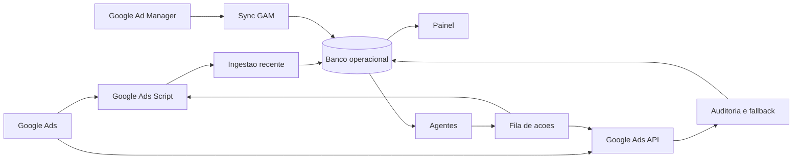

# Graphify - Mapa Sanitizado do Kaizen

Atualizado: 2026-06-25

## Fluxo central

## Comunidades

### Atribuicao

- UTM recebida do clique.
- Attr ID por campanha ou grupo.
- Receita GAM somente com atribuicao comprovada.
- Demand Gen prioriza `adgroupId`.
- Display, Search e Performance Max priorizam `campaignId`.

### Sincronizacao

- Hoje Ads pelo Apps Script.
- Hoje GAM por job rapido.
- Fechamentos em jobs separados.
- Full sync diario para historico e relatorios secundarios.
- Lock, timeout e protecao contra sobreposicao.

### Operacao

- Investimento, receita, lucro, ROI, PMR e eCPM.
- Historico antes/depois para CPA, CPC, orcamento e status.
- Campanhas e projetos descobertos a partir das contas configuradas.
- Divergencias bloqueiam decisoes automaticas.

### Campaign Builder

- Search.
- Demand Gen.
- Performance Max.
- Analise obrigatoria da URL final.
- Campanha modelo opcional.
- Confirmacao de publicacao e erros da API.

### Setup inicial

- OAuth.
- Google Ads.
- GA4.
- GTM.
- WordPress.
- Microsoft Clarity.

### Agentes

- Saude web.
- Consistencia de dados.
- Google Ads Script.
- GAM.
- Orcamento e CPA.
- Campanhas novas.
- UTM e Attr ID.
- Tipos de campanha.
- Placements.
- Aprendizado.

## Travas

- Nenhuma credencial no repositorio.
- Nenhuma receita inventada ou distribuida sem prova.
- Nenhuma acao sem conta destino.
- Nenhum job pesado em rota web.
- Nenhuma implementacao concluida sem teste.
- Nenhuma automacao de alto risco sem autoridade configurada.

## Arquivos relacionados

- `docs/ARCHITECTURE.md`
- `docs/04-UTM-ATTRID.md`
- `docs/05-AGENTES.md`
- `docs/09-CAMPAIGN-BUILDER.md`
- `docs/10-SYNC-ROBUSTEZ.md`
- `docs/11-DESCOBERTA-PROJETOS.md`
- `docs/12-PLACEMENT-EXCLUSIONS.md`
- `docs/SECURITY.md`
